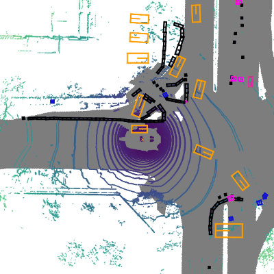

<div align="center">
  
  <div>&nbsp;</div>
  <div align="center">
    <b><font size="5">OpenMMLab 瀹樼綉</font></b>
    <sup>
      <a href="https://openmmlab.com">
        <i><font size="4">HOT</font></i>
      </a>
    </sup>
    &nbsp;&nbsp;&nbsp;&nbsp;
    <b><font size="5">OpenMMLab 寮€鏀惧钩鍙?/font></b>
    <sup>
      <a href="https://platform.openmmlab.com">
        <i><font size="4">TRY IT OUT</font></i>
      </a>
    </sup>
  </div>
  <div>&nbsp;</div>

[](https://pypi.org/project/mmdet3d)
[](https://mmdetection3d.readthedocs.io/zh_CN/latest/)
[](https://github.com/open-mmlab/mmdetection3d/actions)
[](https://codecov.io/gh/open-mmlab/mmdetection3d)
[](https://github.com/open-mmlab/mmdetection3d/blob/main/LICENSE)
[](https://github.com/open-mmlab/mmdetection3d/issues)
[](https://github.com/open-mmlab/mmdetection3d/issues)

[馃摌浣跨敤鏂囨。](https://mmdetection3d.readthedocs.io/zh_CN/latest/) |
[馃洜锔忓畨瑁呮暀绋媇(https://mmdetection3d.readthedocs.io/zh_CN/latest/get_started.html) |
[馃憖妯″瀷搴揮(https://mmdetection3d.readthedocs.io/zh_CN/latest/model_zoo.html) |
[馃啎鏇存柊鏃ュ織](https://mmdetection3d.readthedocs.io/en/latest/notes/changelog.html) |
[馃殌杩涜涓殑椤圭洰](https://github.com/open-mmlab/mmdetection3d/projects) |
[馃鎶ュ憡闂](https://github.com/open-mmlab/mmdetection3d/issues/new/choose)

</div>

<div align="center">

[English](README.md) | 绠€浣撲腑鏂?
</div>

<div align="center">
  <a href="https://openmmlab.medium.com/" style="text-decoration:none;">
    </a>
  
  <a href="https://discord.com/channels/1037617289144569886/1046608014234370059" style="text-decoration:none;">
    </a>
  
  <a href="https://twitter.com/OpenMMLab" style="text-decoration:none;">
    </a>
  
  <a href="https://www.youtube.com/openmmlab" style="text-decoration:none;">
    </a>
  
  <a href="https://space.bilibili.com/1293512903" style="text-decoration:none;">
    </a>
  
  <a href="https://www.zhihu.com/people/openmmlab" style="text-decoration:none;">
    </a>
</div>

## 绠€浠?
MMDetection3D 鏄竴涓熀浜?PyTorch 鐨勭洰鏍囨娴嬪紑婧愬伐鍏风锛屼笅涓€浠ｉ潰鍚?3D 妫€娴嬬殑骞冲彴銆傚畠鏄?[OpenMMlab](https://openmmlab.com/) 椤圭洰鐨勪竴閮ㄥ垎銆?
涓诲垎鏀唬鐮佺洰鍓嶆敮鎸?PyTorch 1.8 浠ヤ笂鐨勭増鏈€?


<details open>
<summary>涓昏鐗规€?/summary>

- **鏀寔澶氭ā鎬?鍗曟ā鎬佺殑妫€娴嬪櫒**

  鏀寔澶氭ā鎬?鍗曟ā鎬佹娴嬪櫒锛屽寘鎷?MVXNet锛孷oteNet锛孭ointPillars 绛夈€?
- **鏀寔鎴峰唴/鎴峰鐨勬暟鎹泦**

  鏀寔瀹ゅ唴/瀹ゅ鐨?3D 妫€娴嬫暟鎹泦锛屽寘鎷?ScanNet锛孲UNRGB-D锛學aymo锛宯uScenes锛孡yft锛孠ITTI銆傚浜?nuScenes 鏁版嵁闆嗭紝鎴戜滑涔熸敮鎸?[nuImages 鏁版嵁闆哴(https://github.com/open-mmlab/mmdetection3d/tree/main/configs/nuimages)銆?
- **涓?2D 妫€娴嬪櫒鐨勮嚜鐒舵暣鍚?*

  [MMDetection](https://github.com/open-mmlab/mmdetection/blob/3.x/docs/zh_cn/model_zoo.md) 鏀寔鐨?**300+ 涓ā鍨嬶紝40+ 鐨勮鏂囩畻娉?*锛屽拰鐩稿叧妯″潡閮藉彲浠ュ湪姝や唬鐮佸簱涓缁冩垨浣跨敤銆?
- **鎬ц兘楂?*

  璁粌閫熷害姣斿叾浠栦唬鐮佸簱鏇村揩銆備笅琛ㄥ彲瑙佷富瑕佺殑瀵规瘮缁撴灉銆傛洿澶氱殑缁嗚妭鍙[鍩哄噯娴嬭瘎鏂囨。](./docs/zh_cn/notes/benchmarks.md)銆傛垜浠姣斾簡姣忕璁粌鐨勬牱鏈暟锛堝€艰秺楂樿秺濂斤級銆傚叾浠栦唬鐮佸簱涓嶆敮鎸佺殑妯″瀷琚爣璁颁负 `鉁梎銆?
  |       Methods       | MMDetection3D | [OpenPCDet](https://github.com/open-mmlab/OpenPCDet) | [votenet](https://github.com/facebookresearch/votenet) | [Det3D](https://github.com/poodarchu/Det3D) |
  | :-----------------: | :-----------: | :--------------------------------------------------: | :----------------------------------------------------: | :-----------------------------------------: |
  |       VoteNet       |      358      |                          鉁?                          |                           77                           |                      鉁?                     |
  |  PointPillars-car   |      141      |                          鉁?                          |                           鉁?                           |                     140                     |
  | PointPillars-3class |      107      |                          44                          |                           鉁?                           |                      鉁?                     |
  |       SECOND        |      40       |                          30                          |                           鉁?                           |                      鉁?                     |
  |       Part-A2       |      17       |                          14                          |                           鉁?                           |                      鉁?                     |

</details>

鍜?[MMDetection](https://github.com/open-mmlab/mmdetection)锛孾MMCV](https://github.com/open-mmlab/mmcv) 涓€鏍凤紝MMDetection3D 涔熷彲浠ヤ綔涓轰竴涓簱鍘绘敮鎸佸悇寮忓悇鏍风殑椤圭洰銆?
## 鏈€鏂拌繘灞?
### 浜偣

鍦?.4鐗堟湰涓紝MMDetecion3D 閲嶆瀯浜?Waymo 鏁版嵁闆? 鍔犻€熶簡 Waymo 鏁版嵁闆嗙殑棰勫鐞嗐€佽缁?娴嬭瘯鍚姩銆侀獙璇佺殑閫熷害銆傚苟涓斿湪 Waymo 涓婃嫇灞曚簡瀵?鍗曠洰/BEV 绛夊熀浜庣浉鏈虹殑涓夌淮鐩爣妫€娴嬫ā鍨嬬殑鏀寔銆傚湪[杩欓噷](https://mmdetection3d.readthedocs.io/en/latest/advanced_guides/datasets/waymo.html)鎻愪緵浜嗗 Waymo 鏁版嵁淇℃伅鐨勮缁嗚В璇汇€?
姝ゅ锛屽湪1.4鐗堟湰涓紝MMDetection3D 鎻愪緵浜?[Waymo-mini](https://download.openmmlab.com/mmdetection3d/data/waymo_mmdet3d_after_1x4/waymo_mini.tar.gz) 鏉ュ府鍔╃ぞ鍖虹敤鎴蜂笂鎵?Waymo 骞剁敤浜庡揩閫熻凯浠ｅ紑鍙戙€?
**v1.4.0** 鐗堟湰宸茬粡鍦?2024.1.8 鍙戝竷锛?
- 鍦?`projects` 涓敮鎸佷簡 [DSVT](<(https://arxiv.org/abs/2301.06051)>) 鐨勮缁?- 鍦?`projects` 涓敮鎸佷簡 [Nerf-Det](https://arxiv.org/abs/2307.14620)
- 閲嶆瀯浜?Waymo 鏁版嵁闆?
**v1.3.0** 鐗堟湰宸茬粡鍦?2023.10.18 鍙戝竷锛?
- 鍦?`projects` 涓敮鎸?[CENet](https://arxiv.org/abs/2207.12691)
- 浣跨敤鏂扮殑 3D inferencers 澧炲己婕旂ず浠ｇ爜鏁堟灉

**v1.2.0** 鐗堟湰宸茬粡鍦?2023.7.4 鍙戝竷锛?
- 鍦?`mmdet3d/configs`涓敮鎸?[鏂癈onfig鏍峰紡](https://mmengine.readthedocs.io/en/latest/advanced_tutorials/config.html#a-pure-python-style-configuration-file-beta)
- 鍦?`projects` 涓敮鎸?[DSVT](<(https://arxiv.org/abs/2301.06051)>) 鐨勬帹鐞?- 鏀寔閫氳繃 `mim` 浠?[OpenDataLab](https://opendatalab.com/) 涓嬭浇鏁版嵁闆?
**v1.1.1** 鐗堟湰宸茬粡鍦?2023.5.30 鍙戝竷锛?
- 鍦?`projects` 涓敮鎸?[TPVFormer](https://arxiv.org/pdf/2302.07817.pdf)
- 鍦?`projects` 涓敮鎸?BEVFusion 鐨勮缁?- 鏀寔鍩轰簬婵€鍏夐浄杈剧殑 3D 璇箟鍒嗗壊鍩哄噯

## 瀹夎

璇峰弬鑰僛蹇€熷叆闂ㄦ枃妗(https://mmdetection3d.readthedocs.io/zh_CN/latest/get_started.html)杩涜瀹夎銆?
## 鏁欑▼

<details>
<summary>鐢ㄦ埛鎸囧崡</summary>

- [璁粌 & 娴嬭瘯](https://mmdetection3d.readthedocs.io/zh_CN/latest/user_guides/index.html#train-test)
  - [瀛︿範閰嶇疆鏂囦欢](https://mmdetection3d.readthedocs.io/zh_CN/latest/user_guides/config.html)
  - [鍧愭爣绯籡(https://mmdetection3d.readthedocs.io/zh_CN/latest/user_guides/coord_sys_tutorial.html)
  - [鏁版嵁棰勫鐞哴(https://mmdetection3d.readthedocs.io/zh_CN/latest/user_guides/dataset_prepare.html)
  - [鑷畾涔夋暟鎹澶勭悊娴佺▼](https://mmdetection3d.readthedocs.io/zh_CN/latest/user_guides/data_pipeline.html)
  - [鍦ㄦ爣娉ㄦ暟鎹泦涓婃祴璇曞拰璁粌](https://mmdetection3d.readthedocs.io/zh_CN/latest/user_guides/train_test.html)
  - [鎺ㄧ悊](https://mmdetection3d.readthedocs.io/zh_CN/latest/user_guides/inference.html)
  - [鍦ㄨ嚜瀹氫箟鏁版嵁闆嗕笂杩涜璁粌](https://mmdetection3d.readthedocs.io/zh_CN/latest/user_guides/new_data_model.html)
- [瀹炵敤宸ュ叿](https://mmdetection3d.readthedocs.io/zh_CN/latest/user_guides/index.html#useful-tools)

</details>

<details>
<summary>杩涢樁鏁欑▼</summary>

- [鏁版嵁闆哴(https://mmdetection3d.readthedocs.io/zh_CN/latest/advanced_guides/index.html#datasets)
  - [KITTI 鏁版嵁闆哴(https://mmdetection3d.readthedocs.io/zh_CN/latest/advanced_guides/datasets/kitti.html)
  - [NuScenes 鏁版嵁闆哴(https://mmdetection3d.readthedocs.io/zh_CN/latest/advanced_guides/datasets/nuscenes.html)
  - [Lyft 鏁版嵁闆哴(https://mmdetection3d.readthedocs.io/zh_CN/latest/advanced_guides/datasets/lyft.html)
  - [Waymo 鏁版嵁闆哴(https://mmdetection3d.readthedocs.io/zh_CN/latest/advanced_guides/datasets/waymo.html)
  - [SUN RGB-D 鏁版嵁闆哴(https://mmdetection3d.readthedocs.io/zh_CN/latest/advanced_guides/datasets/sunrgbd.html)
  - [ScanNet 鏁版嵁闆哴(https://mmdetection3d.readthedocs.io/zh_CN/latest/advanced_guides/datasets/scannet.html)
  - [S3DIS 鏁版嵁闆哴(https://mmdetection3d.readthedocs.io/zh_CN/latest/advanced_guides/datasets/s3dis.html)
  - [SemanticKITTI 鏁版嵁闆哴(https://mmdetection3d.readthedocs.io/zh_CN/latest/advanced_guides/datasets/semantickitti.html)
- [鏀寔鐨勪换鍔(https://mmdetection3d.readthedocs.io/zh_CN/latest/advanced_guides/index.html#supported-tasks)
  - [鍩轰簬婵€鍏夐浄杈剧殑 3D 妫€娴媇(https://mmdetection3d.readthedocs.io/zh_CN/latest/advanced_guides/supported_tasks/lidar_det3d.html)
  - [鍩轰簬瑙嗚鐨?3D 妫€娴媇(https://mmdetection3d.readthedocs.io/zh_CN/latest/advanced_guides/supported_tasks/vision_det3d.html)
  - [鍩轰簬婵€鍏夐浄杈剧殑 3D 璇箟鍒嗗壊](https://mmdetection3d.readthedocs.io/zh_CN/latest/advanced_guides/supported_tasks/lidar_sem_seg3d.html)
- [鑷畾涔夐」鐩甝(https://mmdetection3d.readthedocs.io/zh_CN/latest/advanced_guides/index.html#customization)
  - [鑷畾涔夋暟鎹泦](https://mmdetection3d.readthedocs.io/zh_CN/latest/advanced_guides/customize_dataset.html)
  - [鑷畾涔夋ā鍨媇(https://mmdetection3d.readthedocs.io/zh_CN/latest/advanced_guides/customize_models.html)
  - [鑷畾涔夎繍琛屾椂閰嶇疆](https://mmdetection3d.readthedocs.io/zh_CN/latest/advanced_guides/customize_runtime.html)

</details>

## 鍩哄噯娴嬭瘯鍜屾ā鍨嬪簱

娴嬭瘯缁撴灉鍜屾ā鍨嬪彲浠ュ湪[妯″瀷搴揮(docs/zh_cn/model_zoo.md)涓壘鍒般€?
<div align="center">
  <b>妯″潡缁勪欢</b>
</div>
<table align="center">
  <tbody>
    <tr align="center" valign="bottom">
      <td>
        <b>涓诲共缃戠粶</b>
      </td>
      <td>
        <b>妫€娴嬪ご</b>
      </td>
      <td>
        <b>鐗规€?/b>
      </td>
    </tr>
    <tr valign="top">
      <td>
      <ul>
        <li><a href="configs/pointnet2">PointNet (CVPR'2017)</a></li>
        <li><a href="configs/pointnet2">PointNet++ (NeurIPS'2017)</a></li>
        <li><a href="configs/regnet">RegNet (CVPR'2020)</a></li>
        <li><a href="configs/dgcnn">DGCNN (TOG'2019)</a></li>
        <li>DLA (CVPR'2018)</li>
        <li>MinkResNet (CVPR'2019)</li>
        <li><a href="configs/minkunet">MinkUNet (CVPR'2019)</a></li>
        <li><a href="configs/cylinder3d">Cylinder3D (CVPR'2021)</a></li>
      </ul>
      </td>
      <td>
      <ul>
        <li><a href="configs/free_anchor">FreeAnchor (NeurIPS'2019)</a></li>
      </ul>
      </td>
      <td>
      <ul>
        <li><a href="configs/dynamic_voxelization">Dynamic Voxelization (CoRL'2019)</a></li>
      </ul>
      </td>
    </tr>
</td>
    </tr>
  </tbody>
</table>

<div align="center">
  <b>绠楁硶妯″瀷</b>
</div>
<table align="center">
  <tbody>
    <tr align="center" valign="middle">
      <td>
        <b>婵€鍏夐浄杈?3D 鐩爣妫€娴?/b>
      </td>
      <td>
        <b>鐩告満 3D 鐩爣妫€娴?/b>
      </td>
      <td>
        <b>澶氭ā鎬?3D 鐩爣妫€娴?/b>
      </td>
      <td>
        <b>3D 璇箟鍒嗗壊</b>
      </td>
    </tr>
    <tr valign="top">
      <td>
        <li><b>瀹ゅ</b></li>
        <ul>
            <li><a href="configs/second">SECOND (Sensor'2018)</a></li>
            <li><a href="configs/pointpillars">PointPillars (CVPR'2019)</a></li>
            <li><a href="configs/ssn">SSN (ECCV'2020)</a></li>
            <li><a href="configs/3dssd">3DSSD (CVPR'2020)</a></li>
            <li><a href="configs/sassd">SA-SSD (CVPR'2020)</a></li>
            <li><a href="configs/point_rcnn">PointRCNN (CVPR'2019)</a></li>
            <li><a href="configs/parta2">Part-A2 (TPAMI'2020)</a></li>
            <li><a href="configs/centerpoint">CenterPoint (CVPR'2021)</a></li>
            <li><a href="configs/pv_rcnn">PV-RCNN (CVPR'2020)</a></li>
            <li><a href="projects/CenterFormer">CenterFormer (ECCV'2022)</a></li>
        </ul>
        <li><b>瀹ゅ唴</b></li>
        <ul>
            <li><a href="configs/votenet">VoteNet (ICCV'2019)</a></li>
            <li><a href="configs/h3dnet">H3DNet (ECCV'2020)</a></li>
            <li><a href="configs/groupfree3d">Group-Free-3D (ICCV'2021)</a></li>
            <li><a href="configs/fcaf3d">FCAF3D (ECCV'2022)</a></li>
            <li><a href="projects/TR3D">TR3D (ArXiv'2023)</a></li>
      </ul>
      </td>
      <td>
        <li><b>瀹ゅ</b></li>
        <ul>
          <li><a href="configs/imvoxelnet">ImVoxelNet (WACV'2022)</a></li>
          <li><a href="configs/smoke">SMOKE (CVPRW'2020)</a></li>
          <li><a href="configs/fcos3d">FCOS3D (ICCVW'2021)</a></li>
          <li><a href="configs/pgd">PGD (CoRL'2021)</a></li>
          <li><a href="configs/monoflex">MonoFlex (CVPR'2021)</a></li>
          <li><a href="projects/DETR3D">DETR3D (CoRL'2021)</a></li>
          <li><a href="projects/PETR">PETR (ECCV'2022)</a></li>
        </ul>
        <li><b>Indoor</b></li>
        <ul>
          <li><a href="configs/imvoxelnet">ImVoxelNet (WACV'2022)</a></li>
        </ul>
      </td>
      <td>
        <li><b>瀹ゅ</b></li>
        <ul>
          <li><a href="configs/mvxnet">MVXNet (ICRA'2019)</a></li>
          <li><a href="projects/BEVFusion">BEVFusion (ICRA'2023)</a></li>
        </ul>
        <li><b>瀹ゅ唴</b></li>
        <ul>
          <li><a href="configs/imvotenet">ImVoteNet (CVPR'2020)</a></li>
        </ul>
      </td>
      <td>
        <li><b>瀹ゅ</b></li>
        <ul>
          <li><a href="configs/minkunet">MinkUNet (CVPR'2019)</a></li>
          <li><a href="configs/spvcnn">SPVCNN (ECCV'2020)</a></li>
          <li><a href="configs/cylinder3d">Cylinder3D (CVPR'2021)</a></li>
          <li><a href="projects/TPVFormer">TPVFormer (CVPR'2023)</a></li>
        </ul>
        <li><b>瀹ゅ唴</b></li>
        <ul>
          <li><a href="configs/pointnet2">PointNet++ (NeurIPS'2017)</a></li>
          <li><a href="configs/paconv">PAConv (CVPR'2021)</a></li>
          <li><a href="configs/dgcnn">DGCNN (TOG'2019)</a></li>
        </ul>
      </ul>
      </td>
    </tr>
</td>
    </tr>
  </tbody>
</table>

|               | ResNet | VoVNet | Swin-T | PointNet++ | SECOND | DGCNN | RegNetX | DLA | MinkResNet | Cylinder3D | MinkUNet |
| :-----------: | :----: | :----: | :----: | :--------: | :----: | :---: | :-----: | :-: | :--------: | :--------: | :------: |
|    SECOND     |   鉁?   |   鉁?   |   鉁?   |     鉁?     |   鉁?   |   鉁?  |    鉁?   |  鉁? |     鉁?     |     鉁?     |    鉁?    |
| PointPillars  |   鉁?   |   鉁?   |   鉁?   |     鉁?     |   鉁?   |   鉁?  |    鉁?   |  鉁? |     鉁?     |     鉁?     |    鉁?    |
|  FreeAnchor   |   鉁?   |   鉁?   |   鉁?   |     鉁?     |   鉁?   |   鉁?  |    鉁?   |  鉁? |     鉁?     |     鉁?     |    鉁?    |
|    VoteNet    |   鉁?   |   鉁?   |   鉁?   |     鉁?     |   鉁?   |   鉁?  |    鉁?   |  鉁? |     鉁?     |     鉁?     |    鉁?    |
|    H3DNet     |   鉁?   |   鉁?   |   鉁?   |     鉁?     |   鉁?   |   鉁?  |    鉁?   |  鉁? |     鉁?     |     鉁?     |    鉁?    |
|     3DSSD     |   鉁?   |   鉁?   |   鉁?   |     鉁?     |   鉁?   |   鉁?  |    鉁?   |  鉁? |     鉁?     |     鉁?     |    鉁?    |
|    Part-A2    |   鉁?   |   鉁?   |   鉁?   |     鉁?     |   鉁?   |   鉁?  |    鉁?   |  鉁? |     鉁?     |     鉁?     |    鉁?    |
|    MVXNet     |   鉁?   |   鉁?   |   鉁?   |     鉁?     |   鉁?   |   鉁?  |    鉁?   |  鉁? |     鉁?     |     鉁?     |    鉁?    |
|  CenterPoint  |   鉁?   |   鉁?   |   鉁?   |     鉁?     |   鉁?   |   鉁?  |    鉁?   |  鉁? |     鉁?     |     鉁?     |    鉁?    |
|      SSN      |   鉁?   |   鉁?   |   鉁?   |     鉁?     |   鉁?   |   鉁?  |    鉁?   |  鉁? |     鉁?     |     鉁?     |    鉁?    |
|   ImVoteNet   |   鉁?   |   鉁?   |   鉁?   |     鉁?     |   鉁?   |   鉁?  |    鉁?   |  鉁? |     鉁?     |     鉁?     |    鉁?    |
|    FCOS3D     |   鉁?   |   鉁?   |   鉁?   |     鉁?     |   鉁?   |   鉁?  |    鉁?   |  鉁? |     鉁?     |     鉁?     |    鉁?    |
|  PointNet++   |   鉁?   |   鉁?   |   鉁?   |     鉁?     |   鉁?   |   鉁?  |    鉁?   |  鉁? |     鉁?     |     鉁?     |    鉁?    |
| Group-Free-3D |   鉁?   |   鉁?   |   鉁?   |     鉁?     |   鉁?   |   鉁?  |    鉁?   |  鉁? |     鉁?     |     鉁?     |    鉁?    |
|  ImVoxelNet   |   鉁?   |   鉁?   |   鉁?   |     鉁?     |   鉁?   |   鉁?  |    鉁?   |  鉁? |     鉁?     |     鉁?     |    鉁?    |
|    PAConv     |   鉁?   |   鉁?   |   鉁?   |     鉁?     |   鉁?   |   鉁?  |    鉁?   |  鉁? |     鉁?     |     鉁?     |    鉁?    |
|     DGCNN     |   鉁?   |   鉁?   |   鉁?   |     鉁?     |   鉁?   |   鉁?  |    鉁?   |  鉁? |     鉁?     |     鉁?     |    鉁?    |
|     SMOKE     |   鉁?   |   鉁?   |   鉁?   |     鉁?     |   鉁?   |   鉁?  |    鉁?   |  鉁? |     鉁?     |     鉁?     |    鉁?    |
|      PGD      |   鉁?   |   鉁?   |   鉁?   |     鉁?     |   鉁?   |   鉁?  |    鉁?   |  鉁? |     鉁?     |     鉁?     |    鉁?    |
|   MonoFlex    |   鉁?   |   鉁?   |   鉁?   |     鉁?     |   鉁?   |   鉁?  |    鉁?   |  鉁? |     鉁?     |     鉁?     |    鉁?    |
|    SA-SSD     |   鉁?   |   鉁?   |   鉁?   |     鉁?     |   鉁?   |   鉁?  |    鉁?   |  鉁? |     鉁?     |     鉁?     |    鉁?    |
|    FCAF3D     |   鉁?   |   鉁?   |   鉁?   |     鉁?     |   鉁?   |   鉁?  |    鉁?   |  鉁? |     鉁?     |     鉁?     |    鉁?    |
|    PV-RCNN    |   鉁?   |   鉁?   |   鉁?   |     鉁?     |   鉁?   |   鉁?  |    鉁?   |  鉁? |     鉁?     |     鉁?     |    鉁?    |
|  Cylinder3D   |   鉁?   |   鉁?   |   鉁?   |     鉁?     |   鉁?   |   鉁?  |    鉁?   |  鉁? |     鉁?     |     鉁?     |    鉁?    |
|   MinkUNet    |   鉁?   |   鉁?   |   鉁?   |     鉁?     |   鉁?   |   鉁?  |    鉁?   |  鉁? |     鉁?     |     鉁?     |    鉁?    |
|    SPVCNN     |   鉁?   |   鉁?   |   鉁?   |     鉁?     |   鉁?   |   鉁?  |    鉁?   |  鉁? |     鉁?     |     鉁?     |    鉁?    |
|   BEVFusion   |   鉁?   |   鉁?   |   鉁?   |     鉁?     |   鉁?   |   鉁?  |    鉁?   |  鉁? |     鉁?     |     鉁?     |    鉁?    |
| CenterFormer  |   鉁?   |   鉁?   |   鉁?   |     鉁?     |   鉁?   |   鉁?  |    鉁?   |  鉁? |     鉁?     |     鉁?     |    鉁?    |
|     TR3D      |   鉁?   |   鉁?   |   鉁?   |     鉁?     |   鉁?   |   鉁?  |    鉁?   |  鉁? |     鉁?     |     鉁?     |    鉁?    |
|    DETR3D     |   鉁?   |   鉁?   |   鉁?   |     鉁?     |   鉁?   |   鉁?  |    鉁?   |  鉁? |     鉁?     |     鉁?     |    鉁?    |
|     PETR      |   鉁?   |   鉁?   |   鉁?   |     鉁?     |   鉁?   |   鉁?  |    鉁?   |  鉁? |     鉁?     |     鉁?     |    鉁?    |
|   TPVFormer   |   鉁?   |   鉁?   |   鉁?   |     鉁?     |   鉁?   |   鉁?  |    鉁?   |  鉁? |     鉁?     |     鉁?     |    鉁?    |

**娉ㄦ剰锛?*[MMDetection](https://github.com/open-mmlab/mmdetection/blob/3.x/docs/zh_cn/model_zoo.md) 鏀寔鐨勫熀浜?2D 妫€娴嬬殑 **300+ 涓ā鍨嬶紝40+ 鐨勮鏂囩畻娉?*鍦?MMDetection3D 涓兘鍙互琚缁冩垨浣跨敤銆?
## 甯歌闂

璇峰弬鑰?[FAQ](docs/zh_cn/notes/faq.md) 浜嗚В鍏朵粬鐢ㄦ埛鐨勫父瑙侀棶棰樸€?
## 璐＄尞鎸囧崡

鎴戜滑鎰熻阿鎵€鏈夌殑璐＄尞鑰呬负鏀硅繘鍜屾彁鍗?MMDetection3D 鎵€浣滃嚭鐨勫姫鍔涖€傝鍙傝€僛璐＄尞鎸囧崡](docs/en/notes/contribution_guides.md)鏉ヤ簡瑙ｅ弬涓庨」鐩础鐚殑鐩稿叧鎸囧紩銆?
## 鑷磋阿

MMDetection3D 鏄竴娆剧敱鏉ヨ嚜涓嶅悓楂樻牎鍜屼紒涓氱殑鐮斿彂浜哄憳鍏卞悓鍙備笌璐＄尞鐨勫紑婧愰」鐩€傛垜浠劅璋㈡墍鏈変负椤圭洰鎻愪緵绠楁硶澶嶇幇鍜屾柊鍔熻兘鏀寔鐨勮础鐚€咃紝浠ュ強鎻愪緵瀹濊吹鍙嶉鐨勭敤鎴枫€傛垜浠笇鏈涜繖涓伐鍏风鍜屽熀鍑嗘祴璇曞彲浠ヤ负绀惧尯鎻愪緵鐏垫椿鐨勪唬鐮佸伐鍏凤紝渚涚敤鎴峰鐜板凡鏈夌畻娉曞苟寮€鍙戣嚜宸辩殑鏂扮殑 3D 妫€娴嬫ā鍨嬨€?
## 寮曠敤

濡傛灉浣犺寰楁湰椤圭洰瀵逛綘鐨勭爺绌跺伐浣滄湁鎵€甯姪锛岃鍙傝€冨涓?bibtex 寮曠敤 MMdetection3D锛?
```latex
@misc{mmdet3d2020,
    title={{MMDetection3D: OpenMMLab} next-generation platform for general {3D} object detection},
    author={MMDetection3D Contributors},
    howpublished = {\url{https://github.com/open-mmlab/mmdetection3d}},
    year={2020}
}
```

## 寮€婧愯鍙瘉

璇ラ」鐩噰鐢?[Apache 2.0 寮€婧愯鍙瘉](LICENSE)銆?
## OpenMMLab 鐨勫叾浠栭」鐩?
- [MMEngine](https://github.com/open-mmlab/mmengine): OpenMMLab 娣卞害瀛︿範妯″瀷璁粌鍩虹搴?- [MMCV](https://github.com/open-mmlab/mmcv): OpenMMLab 璁＄畻鏈鸿瑙夊熀纭€搴?- [MMEval](https://github.com/open-mmlab/mmeval): 缁熶竴寮€鏀剧殑璺ㄦ鏋剁畻娉曡瘎娴嬪簱
- [MIM](https://github.com/open-mmlab/mim): MIM 鏄?OpenMMlab 椤圭洰銆佺畻娉曘€佹ā鍨嬬殑缁熶竴鍏ュ彛
- [MMPreTrain](https://github.com/open-mmlab/mmpretrain): OpenMMLab 娣卞害瀛︿範棰勮缁冨伐鍏风
- [MMDetection](https://github.com/open-mmlab/mmdetection): OpenMMLab 鐩爣妫€娴嬪伐鍏风
- [MMDetection3D](https://github.com/open-mmlab/mmdetection3d): OpenMMLab 鏂颁竴浠ｉ€氱敤 3D 鐩爣妫€娴嬪钩鍙?- [MMRotate](https://github.com/open-mmlab/mmrotate): OpenMMLab 鏃嬭浆妗嗘娴嬪伐鍏风涓庢祴璇曞熀鍑?- [MMYOLO](https://github.com/open-mmlab/mmyolo): OpenMMLab YOLO 绯诲垪宸ュ叿绠变笌娴嬭瘯鍩哄噯
- [MMSegmentation](https://github.com/open-mmlab/mmsegmentation): OpenMMLab 璇箟鍒嗗壊宸ュ叿绠?- [MMOCR](https://github.com/open-mmlab/mmocr): OpenMMLab 鍏ㄦ祦绋嬫枃瀛楁娴嬭瘑鍒悊瑙ｅ伐鍏峰寘
- [MMPose](https://github.com/open-mmlab/mmpose): OpenMMLab 濮挎€佷及璁″伐鍏风
- [MMHuman3D](https://github.com/open-mmlab/mmhuman3d): OpenMMLab 浜轰綋鍙傛暟鍖栨ā鍨嬪伐鍏风涓庢祴璇曞熀鍑?- [MMSelfSup](https://github.com/open-mmlab/mmselfsup): OpenMMLab 鑷洃鐫ｅ涔犲伐鍏风涓庢祴璇曞熀鍑?- [MMRazor](https://github.com/open-mmlab/mmrazor): OpenMMLab 妯″瀷鍘嬬缉宸ュ叿绠变笌娴嬭瘯鍩哄噯
- [MMFewShot](https://github.com/open-mmlab/mmfewshot): OpenMMLab 灏戞牱鏈涔犲伐鍏风涓庢祴璇曞熀鍑?- [MMAction2](https://github.com/open-mmlab/mmaction2): OpenMMLab 鏂颁竴浠ｈ棰戠悊瑙ｅ伐鍏风
- [MMTracking](https://github.com/open-mmlab/mmtracking): OpenMMLab 涓€浣撳寲瑙嗛鐩爣鎰熺煡骞冲彴
- [MMFlow](https://github.com/open-mmlab/mmflow): OpenMMLab 鍏夋祦浼拌宸ュ叿绠变笌娴嬭瘯鍩哄噯
- [MMagic](https://github.com/open-mmlab/mmagic): OpenMMLab 鏂颁竴浠ｄ汉宸ユ櫤鑳藉唴瀹圭敓鎴愶紙AIGC锛夊伐鍏风
- [MMGeneration](https://github.com/open-mmlab/mmgeneration): OpenMMLab 鍥剧墖瑙嗛鐢熸垚妯″瀷宸ュ叿绠?- [MMDeploy](https://github.com/open-mmlab/mmdeploy): OpenMMLab 妯″瀷閮ㄧ讲妗嗘灦

## 娆㈣繋鍔犲叆 OpenMMLab 绀惧尯

鎵弿涓嬫柟鐨勪簩缁寸爜鍙叧娉?OpenMMLab 鍥㈤槦鐨?[鐭ヤ箮瀹樻柟璐﹀彿](https://www.zhihu.com/people/openmmlab)锛屾壂鎻忎笅鏂瑰井淇′簩缁寸爜娣诲姞鍠靛柕濂藉弸锛岃繘鍏?MMDetection3D 寰俊浜ゆ祦绀剧兢銆傘€愬姞濂藉弸鐢宠鏍煎紡锛氱爺绌舵柟鍚?鍦板尯+瀛︽牎/鍏徃+濮撳悕銆?
<div align="center">
  
</div>

鎴戜滑浼氬湪 OpenMMLab 绀惧尯涓哄ぇ瀹?
- 馃摙 鍒嗕韩 AI 妗嗘灦鐨勫墠娌挎牳蹇冩妧鏈?- 馃捇 瑙ｈ PyTorch 甯哥敤妯″潡婧愮爜
- 馃摪 鍙戝竷 OpenMMLab 鐨勭浉鍏虫柊闂?- 馃殌 浠嬬粛 OpenMMLab 寮€鍙戠殑鍓嶆部绠楁硶
- 馃弮 鑾峰彇鏇撮珮鏁堢殑闂绛旂枒鍜屾剰瑙佸弽棣?- 馃敟 鎻愪緵涓庡悇琛屽悇涓氬紑鍙戣€呭厖鍒嗕氦娴佺殑骞冲彴

骞茶揣婊℃弧 馃摌锛岀瓑浣犳潵鎾?馃挆锛孫penMMLab 绀惧尯鏈熷緟鎮ㄧ殑鍔犲叆 馃懍

