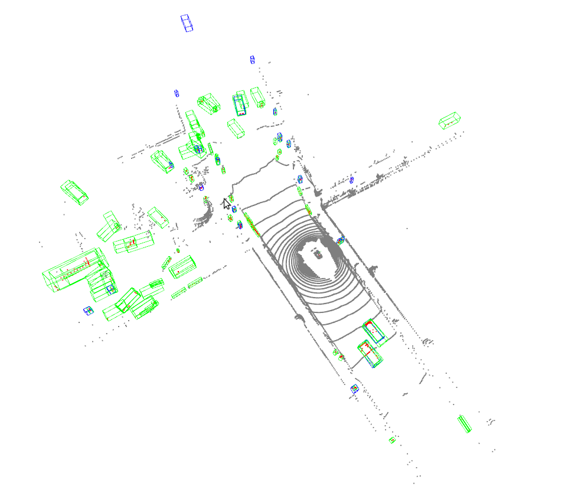

# 鍙鍖?
MMDetection3D 鎻愪緵浜?`Det3DLocalVisualizer` 鐢ㄦ潵鍦ㄨ缁冨強娴嬭瘯闃舵鍙鍖栧拰瀛樺偍妯″瀷鐨勭姸鎬佷互鍙婄粨鏋滐紝鍏跺叿鏈変互涓嬬壒鎬э細

1. 鏀寔澶氭ā鎬佹暟鎹拰澶氫换鍔＄殑鍩烘湰缁樺浘鐣岄潰銆?2. 鏀寔澶氫釜鍚庣锛堝 local锛孴ensorBoard锛夛紝灏嗚缁冪姸鎬侊紙濡?`loss`锛宍lr`锛夋垨妯″瀷璇勪及鎸囨爣鍐欏叆鎸囧畾鐨勪竴涓垨澶氫釜鍚庣涓€?3. 鏀寔澶氭ā鎬佹暟鎹湡瀹炴爣绛剧殑鍙鍖栵紝3D 妫€娴嬬粨鏋滅殑璺ㄦā鎬佸彲瑙嗗寲銆?
## 鍩烘湰缁樺埗鐣岄潰

缁ф壙鑷?`DetLocalVisualizer`锛宍Det3DLocalVisualizer` 鎻愪緵浜嗗湪 2D 鍥惧儚涓婄粯鍒跺父瑙佺洰鏍囩殑鐣岄潰锛屼緥濡傜粯鍒舵娴嬫銆佺偣銆佹枃鏈€佺嚎銆佸渾銆佸杈瑰舰銆佷簩杩涘埗鎺╃爜绛夈€傚叧浜?2D 缁樺埗鐨勬洿澶氱粏鑺傦紝璇峰弬鑰?MMDetection 涓殑[鍙鍖栨枃妗(https://mmengine.readthedocs.io/zh_CN/latest/advanced_tutorials/visualization.html)銆傝繖閲屾垜浠粙缁?3D 缁樺埗鐣岄潰銆?
### 鍦ㄥ浘鍍忎笂缁樺埗鐐逛簯

閫氳繃浣跨敤 `draw_points_on_image`锛屾垜浠敮鎸佸湪鍥惧儚涓婄粯鍒剁偣浜戙€?
```python
import mmcv
import numpy as np
from mmengine import load

from mmdet3d.visualization import Det3DLocalVisualizer

info_file = load('demo/data/kitti/000008.pkl')
points = np.fromfile('demo/data/kitti/000008.bin', dtype=np.float32)
points = points.reshape(-1, 4)[:, :3]
lidar2img = np.array(info_file['data_list'][0]['images']['CAM2']['lidar2img'], dtype=np.float32)

visualizer = Det3DLocalVisualizer()
img = mmcv.imread('demo/data/kitti/000008.png')
img = mmcv.imconvert(img, 'bgr', 'rgb')
visualizer.set_image(img)
visualizer.draw_points_on_image(points, lidar2img)
visualizer.show()
```


### 鍦ㄧ偣浜戜笂缁樺埗 3D 妗?
閫氳繃浣跨敤 `draw_bboxes_3d`锛屾垜浠敮鎸佸湪鐐逛簯涓婄粯鍒?3D 妗嗐€?
```python
import torch
import numpy as np

from mmdet3d.visualization import Det3DLocalVisualizer
from mmdet3d.structures import LiDARInstance3DBoxes

points = np.fromfile('demo/data/kitti/000008.bin', dtype=np.float32)
points = points.reshape(-1, 4)
visualizer = Det3DLocalVisualizer()
# set point cloud in visualizer
visualizer.set_points(points)
bboxes_3d = LiDARInstance3DBoxes(
    torch.tensor([[8.7314, -1.8559, -1.5997, 4.2000, 3.4800, 1.8900,
                   -1.5808]]))
# Draw 3D bboxes
visualizer.draw_bboxes_3d(bboxes_3d)
visualizer.show()
```


### 鍦ㄥ浘鍍忎笂缁樺埗鎶曞奖鐨?3D 妗?
閫氳繃浣跨敤 `draw_proj_bboxes_3d`锛屾垜浠敮鎸佸湪鍥惧儚涓婄粯鍒舵姇褰辩殑 3D 妗嗐€?
```python
import mmcv
import numpy as np
from mmengine import load

from mmdet3d.visualization import Det3DLocalVisualizer
from mmdet3d.structures import CameraInstance3DBoxes

info_file = load('demo/data/kitti/000008.pkl')
cam2img = np.array(info_file['data_list'][0]['images']['CAM2']['cam2img'], dtype=np.float32)
bboxes_3d = []
for instance in info_file['data_list'][0]['instances']:
    bboxes_3d.append(instance['bbox_3d'])
gt_bboxes_3d = np.array(bboxes_3d, dtype=np.float32)
gt_bboxes_3d = CameraInstance3DBoxes(gt_bboxes_3d)
input_meta = {'cam2img': cam2img}

visualizer = Det3DLocalVisualizer()

img = mmcv.imread('demo/data/kitti/000008.png')
img = mmcv.imconvert(img, 'bgr', 'rgb')
visualizer.set_image(img)
# project 3D bboxes to image
visualizer.draw_proj_bboxes_3d(gt_bboxes_3d, input_meta)
visualizer.show()
```

### 缁樺埗 BEV 瑙嗚鐨勬

閫氳繃浣跨敤 `draw_bev_bboxes`锛屾垜浠敮鎸佺粯鍒?BEV 瑙嗚涓嬬殑妗嗐€?
```python
import numpy as np
from mmengine import load

from mmdet3d.visualization import Det3DLocalVisualizer
from mmdet3d.structures import CameraInstance3DBoxes

info_file = load('demo/data/kitti/000008.pkl')
bboxes_3d = []
for instance in info_file['data_list'][0]['instances']:
    bboxes_3d.append(instance['bbox_3d'])
gt_bboxes_3d = np.array(bboxes_3d, dtype=np.float32)
gt_bboxes_3d = CameraInstance3DBoxes(gt_bboxes_3d)

visualizer = Det3DLocalVisualizer()
# set bev image in visualizer
visualizer.set_bev_image()
# draw bev bboxes
visualizer.draw_bev_bboxes(gt_bboxes_3d, edge_colors='orange')
visualizer.show()
```

### 缁樺埗 3D 鍒嗗壊鎺╃爜

閫氳繃浣跨敤 `draw_seg_mask`锛屾垜浠敮鎸侀€氳繃閫愮偣鐫€鑹叉潵缁樺埗鍒嗗壊鎺╃爜銆?
```python
import numpy as np

from mmdet3d.visualization import Det3DLocalVisualizer

points = np.fromfile('demo/data/sunrgbd/000017.bin', dtype=np.float32)
points = points.reshape(-1, 3)
visualizer = Det3DLocalVisualizer()
mask = np.random.rand(points.shape[0], 3)
points_with_mask = np.concatenate((points, mask), axis=-1)
# Draw 3D points with mask
visualizer.set_points(points, pcd_mode=2, vis_mode='add')
visualizer.draw_seg_mask(points_with_mask)
visualizer.show()
```

## 缁撴灉

濡傛灉鎯宠鍙鍖栬缁冩ā鍨嬬殑棰勬祴缁撴灉锛屼綘鍙互杩愯濡備笅鎸囦护锛?
```bash
python tools/test.py ${CONFIG_FILE} ${CKPT_PATH} --show --show-dir ${SHOW_DIR}
```

杩愯璇ユ寚浠ゅ悗锛岀粯鍒剁殑缁撴灉锛堝寘鎷緭鍏ユ暟鎹拰缃戠粶杈撳嚭鍦ㄨ緭鍏ヤ笂鐨勫彲瑙嗗寲锛夊皢浼氳淇濆瓨鍦?`${SHOW_DIR}` 涓€?
杩愯璇ユ寚浠ゅ悗锛屼綘灏嗗湪 `${SHOW_DIR}` 涓幏寰楄緭鍏ユ暟鎹紝缃戠粶杈撳嚭鍜岀湡鏄爣绛惧湪杈撳叆涓婄殑鍙鍖栵紙濡傚湪澶氭ā鎬佹娴嬩换鍔″拰鍩轰簬瑙嗚鐨勬娴嬩换鍔′腑鐨?`***_gt.png` 鍜?`***_pred.png`锛夈€傚綋鍚敤 `show` 鏃讹紝[Open3D](http://www.open3d.org/) 灏嗕細鐢ㄤ簬鍦ㄧ嚎鍙鍖栫粨鏋溿€傚鏋滀綘鏄湪娌℃湁 GUI 鐨勮繙绋嬫湇鍔″櫒涓婃祴璇曟椂锛屽湪绾垮彲瑙嗗寲鏄笉琚敮鎸佺殑銆備綘鍙互浠庤繙绋嬫湇鍔″櫒涓笅杞?`results.pkl`锛屽苟鍦ㄦ湰鍦版満鍣ㄤ笂绂荤嚎鍙鍖栭娴嬬粨鏋溿€?
浣跨敤 `Open3D` 鍚庣绂荤嚎鍙鍖栫粨鏋滐紝浣犲彲浠ヨ繍琛屽涓嬫寚浠わ細

```bash
python tools/misc/visualize_results.py ${CONFIG_FILE} --result ${RESULTS_PATH} --show-dir ${SHOW_DIR}
```



杩欓渶瑕佸湪杩滅▼鏈嶅姟鍣ㄤ腑鑳藉鎺ㄧ悊骞剁敓鎴愮粨鏋滐紝鐒跺悗鐢ㄦ埛鍦ㄤ富鏈轰腑浣跨敤 GUI 鎵撳紑銆?
## 鏁版嵁闆?
鎴戜滑涔熸彁渚涗簡鑴氭湰鏉ュ彲瑙嗗寲鏁版嵁闆嗚€屾棤闇€鎺ㄧ悊銆備綘鍙互浣跨敤 `tools/misc/browse_dataset.py` 鏉ュ湪绾垮彲瑙嗗寲鍔犺浇鐨勬暟鎹殑鐪熷疄鏍囩锛屽苟淇濆瓨鍦ㄧ‖鐩樹腑銆傜洰鍓嶆垜浠敮鎸佹墍鏈夋暟鎹泦鐨勫崟妯℃€?3D 妫€娴嬪拰 3D 鍒嗗壊锛孠ITTI 鍜?SUN RGB-D 鐨勫妯℃€?3D 妫€娴嬶紝浠ュ強 nuScenes 鐨勫崟鐩?3D 妫€娴嬨€傚鏋滄兂瑕佹祻瑙?KITTI 鏁版嵁闆嗭紝浣犲彲浠ヨ繍琛屽涓嬫寚浠わ細

```shell
python tools/misc/browse_dataset.py configs/_base_/datasets/kitti-3d-3class.py --task lidar_det --output-dir ${OUTPUT_DIR}
```

**娉ㄦ剰**锛氫竴鏃︽寚瀹氫簡 `--output-dir`锛屽綋鍦?open3d 绐楀彛涓寜涓?`_ESC_` 鏃讹紝鐢ㄦ埛鎸囧畾鐨勮鍥惧浘鍍忓皢浼氳淇濆瓨涓嬫潵銆傚鏋滀綘鎯宠瀵圭偣浜戣繘琛岀缉鏀炬搷浣滀互瑙傚療鏇村缁嗚妭锛?浣犲彲浠ュ湪鍛戒护涓寚瀹?`--show-interval=0`銆?
涓轰簡楠岃瘉鏁版嵁鐨勪竴鑷存€у拰鏁版嵁澧炲己鐨勬晥鏋滐紝浣犲彲浠ュ姞涓?`--aug` 鏉ュ彲瑙嗗寲鏁版嵁澧炲己鍚庣殑鏁版嵁锛屾寚浠ゅ涓嬫墍绀猴細

```shell
python tools/misc/browse_dataset.py configs/_base_/datasets/kitti-3d-3class.py --task det --aug --output-dir ${OUTPUT_DIR}
```

濡傛灉浣犳兂鏄剧ず甯︽湁鎶曞奖鐨?3D 杈圭晫妗嗙殑 2D 鍥惧儚锛屼綘闇€瑕佷竴涓敮鎸佸妯℃€佹暟鎹姞杞界殑閰嶇疆鏂囦欢锛屽苟灏?`--task` 鍙傛暟鏀逛负 `multi-modality_det`銆傜ず渚嬪涓嬶細

```shell
python tools/misc/browse_dataset.py configs/mvxnet/mvxnet_fpn_dv_second_secfpn_8xb2-80e_kitti-3d-3class.py --task multi-modality_det --output-dir ${OUTPUT_DIR}
```


浣犲彲浠ヤ娇鐢ㄤ笉鍚岀殑閰嶇疆娴忚涓嶅悓鐨勬暟鎹泦锛屼緥濡傚湪 3D 璇箟鍒嗗壊浠诲姟涓彲瑙嗗寲 ScanNet 鏁版嵁闆嗭細

```shell
python tools/misc/browse_dataset.py configs/_base_/datasets/scannet-seg.py --task lidar_seg --output-dir ${OUTPUT_DIR}
```


鍦ㄥ崟鐩?3D 妫€娴嬩换鍔′腑娴忚 nuScenes 鏁版嵁闆嗭細

```shell
python tools/misc/browse_dataset.py configs/_base_/datasets/nus-mono3d.py --task mono_det --output-dir ${OUTPUT_DIR}
```


